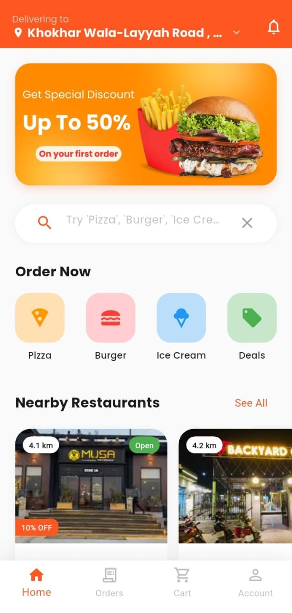
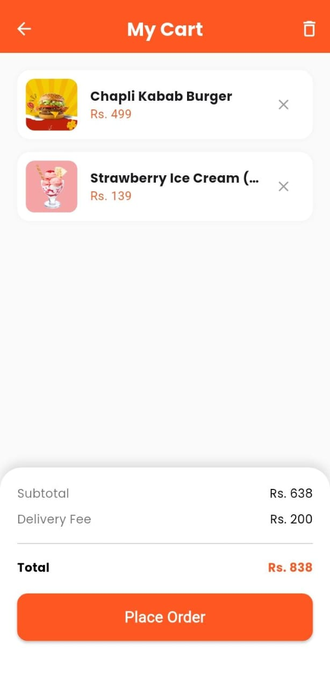
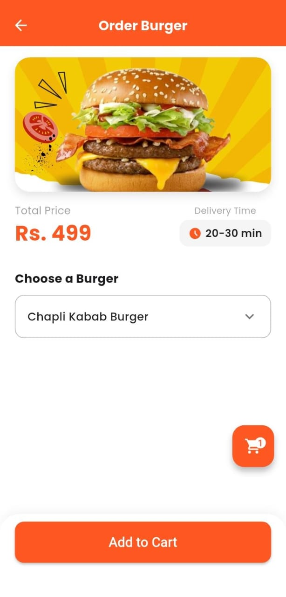
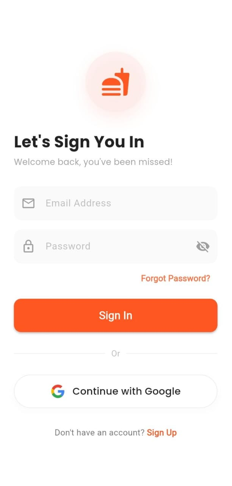

# 🍔 Foody - Flutter Food Delivery App

Foody is a fully functional food delivery application UI and Logic demo built using **Flutter**. It features a modern user interface, real-time location tracking using Mapbox/Geoapify, Firebase Authentication, and a dynamic cart system.

## 📱 Screenshots

|                      Home Screen                      |                      Cart Screen                      |                      Item Screen                       |                         Authentication                          |
|:-----------------------------------------------------:|:-----------------------------------------------------:|:------------------------------------------------------:|:---------------------------------------------------------------:|
|  |  |  |  |

*(Note: Add your screenshots to an assets/screenshots folder to make this visible)*

## ✨ Features

*   **Authentication:**
    *   Login & Sign Up with Email/Password (Firebase).
    *   Google Sign-In integration.
    *   Persistent login state (Auto-login on app restart).
*   **Location Services:**
    *   Real-time GPS location fetching.
    *   Reverse Geocoding (Converts Coordinates to Address).
    *   Interactive Map Picker using **Mapbox** & **flutter_map**.
    *   Location persistence using Shared Preferences.
*   **Restaurant & Menu:**
    *   Dynamic Restaurant Cards with distance calculation.
    *   **Custom Pizza Builder:** Select Size, Flavour, and see dynamic price updates.
    *   **Restaurant Details:** SliverAppBar animations, Menu sliders, and WhatsApp Order integration.
*   **Cart & Checkout:**
    *   Global Cart State management (ValueNotifier).
    *   Add/Remove items with real-time bill calculation.
    *   Checkout screen with map preview and payment method selection.
*   **UI/UX:**
    *   Custom Splash Screen (Android 12+ compatible).
    *   Beautiful Animations and Custom Widgets.
    *   Optimized assets handling (`UniversalImage` for Network/Local support).

## 🛠️ Tech Stack

*   **Framework:** [Flutter](https://flutter.dev/) (Dart)
*   **Backend:** Firebase (Auth)
*   **Maps API:** Mapbox / Geoapify
*   **State Management:** Native `ValueNotifier` & `setState`
*   **Local Storage:** `shared_preferences`

## 📦 Key Dependencies

*   `firebase_auth`
*   `google_sign_in`
*   `geolocator` & `geocoding`
*   `flutter_map` & `latlong2`
*   `http`
*   `url_launcher` (For WhatsApp integration)
*   `cached_network_image`

## 🚀 How to Run

1.  **Clone the repository:**
    ```bash
    git clone https://github.com/yourusername/food-delivery-app-flutter.git
    ```
2.  **Install dependencies:**
    ```bash
    flutter pub get
    ```
3.  **Firebase Setup:**
    *   Add your own `google-services.json` file to `android/app/`.
    *   Enable Authentication (Email & Google) in Firebase Console.
    *   Add your SHA-1 Key to Firebase Project Settings.
4.  **API Keys:**
    *   Replace the Mapbox/Geoapify token in `lib/screens/location_picker_screen.dart`.
5.  **Run the app:**
    ```bash
    flutter run
    ```

## 🔐 Key Generation (For Release)
This project requires a `key.properties` file in the `android/` directory to build the release APK/Bundle.

## 👤 Author
**Asad Yaseen **
- [GitHub](https://github.com/asadyaseen1499-gif)
- [LinkedIn](https://linkedin.com/in/asadyaseen)
